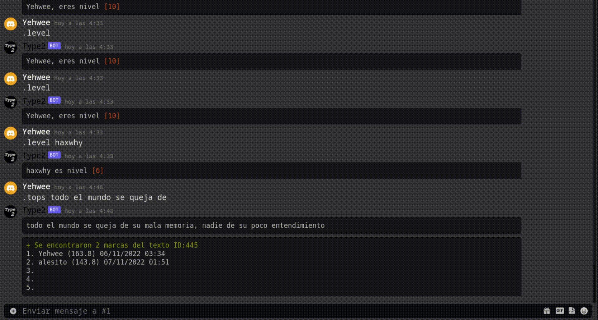

# Type Bot
Discord bot to measure your typing speed. Type is not a huge project, so it is not meant to be used on many servers, nor in many channels. It is a recreational bot for a single channel, in a single server.

## Example

## Build
1. Clone repository.

`git clone https://github.com/YogurtQQ/Type`

2. Change directory into directory.

`cd Type`

3. Change your token at private.sh file.

`nano private.sh`

4. Run.

`sh private.sh`
